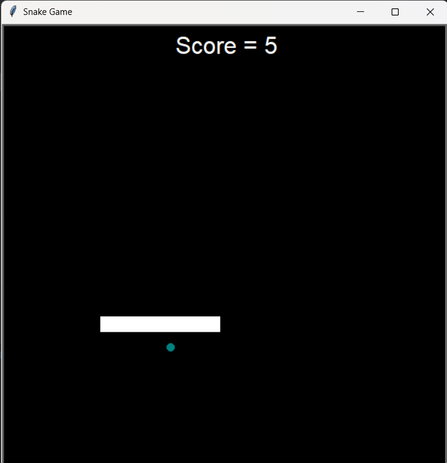
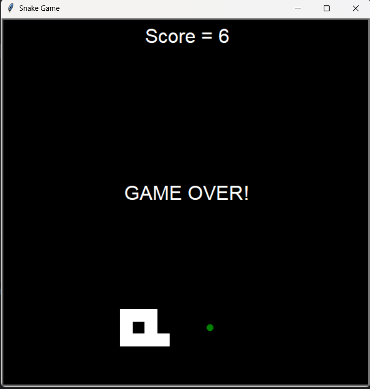

# 🐍 Snake Game (Python Turtle)

A classic **Snake Game** built using **Python and the Turtle Graphics module**, featuring smooth movement, real-time score tracking, colorful food generation, and collision-based game-over logic.

This project demonstrates **core programming concepts** such as Object-Oriented Programming (OOP), game loops, collision detection, and keyboard event handling.

---

## 🎮 Gameplay Preview

### ▶️ In-Game View

### 💀 Game Over Screen

---

## 🧠 Game Description

The Snake Game is a timeless arcade-style game where the player controls a snake that moves continuously across the screen.

- The snake grows longer each time it eats food.
- Food appears at random positions with random colors.
- The player must avoid:
  - colliding with the screen boundaries
  - colliding with the snake’s own body

Once a collision occurs, the game ends and a **GAME OVER** message is displayed along with the final score.

---

## ✨ Features

- 🐍 Smooth snake movement using frame-based animation  
- 🎯 Random food spawning with dynamic colors  
- 📊 Real-time score tracking  
- 💥 Collision detection (wall & self collision)  
- ⌨️ Keyboard-controlled movement  
- 🧱 Clean Object-Oriented Programming structure  
- ⚡ Optimized animation using `screen.tracer(0)`  

---

## 🕹️ Controls

| Key | Action |
|-----|--------|
| ⬆️ Up Arrow | Move Up |
| ⬇️ Down Arrow | Move Down |
| ⬅️ Left Arrow | Move Left |
| ➡️ Right Arrow | Move Right |

> The snake cannot instantly move in the opposite direction, following classic snake game rules.

---

